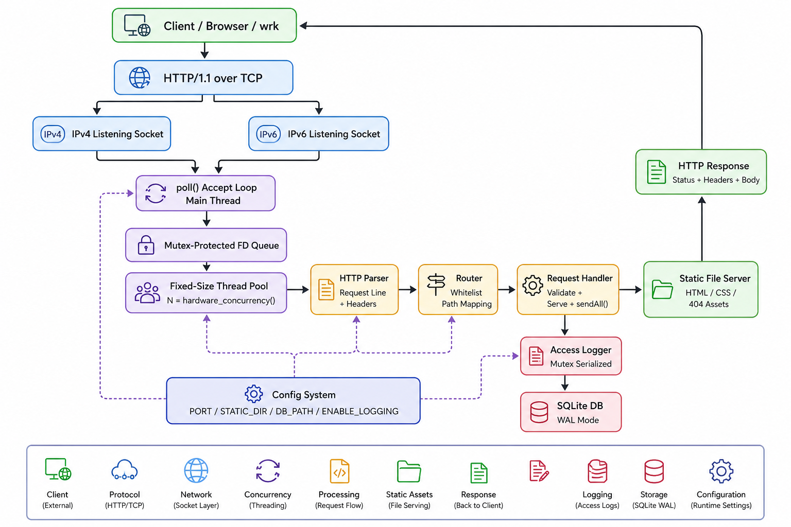
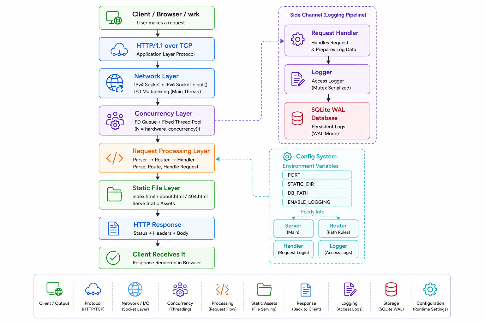
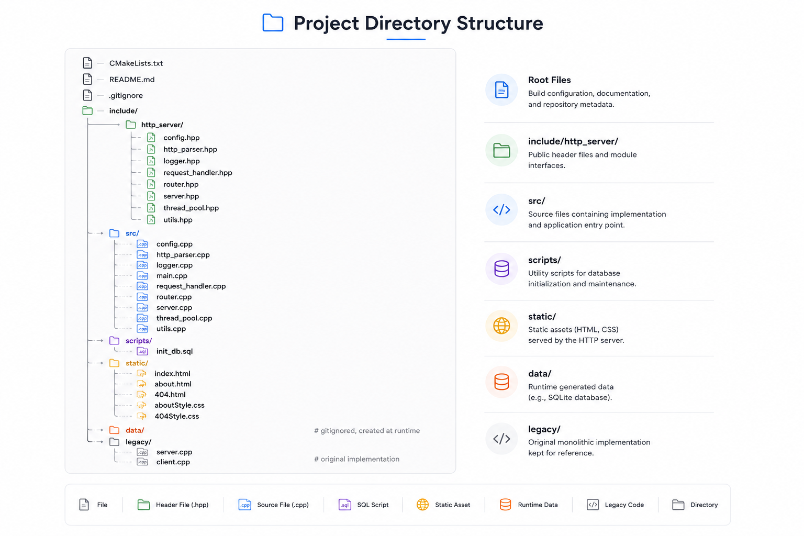

# http-server

A blazingly fast, multi-threaded **HTTP/1.1 server** built entirely from scratch in modern **C++17**. No bulky frameworks—just raw performance, clean architecture, and embedded SQLite logging.

| 22,000+ req/sec (Clean) | ~8,000 req/sec (With Logging) | Dual-Stack IPv4 / IPv6 |
| :---: | :---: | :---: |

### Why I Built This

This project started as a raw "learn-by-building" monolith (preserved in `legacy/`). It has since evolved into a production-grade showcase of **concurrency, modular design, and observability**.

---

## Quick Links
* [✨ Core Highlights](#-highlights)
* [🏛️ Architecture & Blueprints](#-architecture)
* [🛠️ Getting Started (Quick Run)](#️-building-from-source)
* [⚙️ Configuration & Routes](#-configuration)

---

## Highlights

* **22,000+ requests/sec** under `wrk` benchmark (logging disabled); **~8,000 req/sec** with full SQLite access logging.
* **Zero external runtime dependencies** beyond `libsqlite3` and the C++ standard library.
* **Dual-stack networking** — separate IPv4 and IPv6 listening sockets, multiplexed via `poll()`.
* **Fixed-size thread pool** with a mutex-guarded queue and condition variable, sized to `std::thread::hardware_concurrency()`.
* **SQLite WAL-mode logging** with prepared statements; one mutex serializes writes across all workers.
* **Graceful shutdown** via `SIGINT`/`SIGTERM` signal handlers and an atomic running flag.
* **Toggleable logging** — flip access logging on or off via an environment variable, no recompilation required.

---

## Architecture & Blueprints

### 1. High-Level Blueprint
The main thread handles the rapid-fire incoming connections across both IPv4 and IPv6 protocols, completely shielding the worker pool from connection overhead.



### 2. The Internal Pipeline
A deep-dive look at the file descriptor routing queue and the asynchronous-adjacent side-channel logging network.



### 3. Clean Project Layout
Designed to map cleanly to modern CMake standards with a strict separation of concerns.



---

## Deep-Dive Engineering Details

<details>
<summary><b> Click to view core design choices & optimizations</b></summary>

* **The main thread** runs a `poll()` loop with a 500 ms timeout — long enough to be efficient under load, short enough to notice a shutdown signal promptly.
* **The worker pool size** defaults to `hardware_concurrency()` but falls back to a minimum of two threads if the runtime reports zero.
* **The fd queue** is the only point of contention on the hot path. Workers spend the vast majority of their time in `recv()`, `read()`, and `send()`, not waiting on the queue lock.
* **Logging** is serialized through a single mutex inside `Logger`. SQLite in WAL mode handles this efficiently — readers can run concurrently with the writer.
* **CMake layout** maps cleanly to expectations: a single `file(GLOB ...)` over `src/*.cpp` picks up every translation unit, and `target_include_directories(... include)` makes all module headers resolvable as `#include "http_server/<module>.hpp"`.

</details>

<details>
<summary><b> Click to view Module Responsibilities</b></summary>

| Module | Responsibility |
|---|---|
| **`config`** | Loads `PORT`, `STATIC_DIR`, `DB_PATH`, `ENABLE_LOGGING` from environment variables with safe defaults and validation. |
| **`http_parser`** | Parses the HTTP request line and headers into a structured `ParsedRequest`. Returns `valid = false` on malformed input. |
| **`router`** | Maps HTTP paths to file paths under the static directory. Whitelist-based; unknown routes fall back to the 404 page. |
| **`request_handler`** | Reads one request, validates the method, serves the file via partial-write-safe `sendAll()`, and records the access. |
| **`thread_pool`** | Fixed-size worker pool with a thread-safe fd queue. RAII shutdown drains and closes any leftover descriptors. |
| **`logger`** | SQLite-backed access log. Initializes schema on first run, uses a prepared `INSERT` statement, serializes writes with a mutex. |
| **`server`** | Owns the listening sockets, dual-stack setup, the `poll()` accept loop, and the full lifecycle. |
| **`utils`** | Small standalone helpers: `trim()`, `getContentType()`. |

</details>

---

## Spin It Up in 60 Seconds

### 1. Install dependencies

```bash
# macOS
brew install cmake sqlite pkg-config

# Ubuntu / Debian
sudo apt install build-essential cmake libsqlite3-dev pkg-config
```

### 2. Build

```bash
cmake -S . -B build
cmake --build build -j
```

### 3. Run

```bash
mkdir -p data
./build/bin/http_server
```

Open the server:

```bash
curl -i http://localhost:8080/
```

Or visit:

```text
http://localhost:8080/
```

---

## Configuration

Runtime settings are provided through environment variables.

| Variable | Default | Purpose |
|---|---:|---|
| `PORT` | `8080` | Server port |
| `STATIC_DIR` | `static` | Static file directory |
| `DB_PATH` | `data/logs.db` | SQLite log database |
| `ENABLE_LOGGING` | `true` | Enable request logging |

Example:

```bash
PORT=9000 ENABLE_LOGGING=false ./build/bin/http_server
```

---

## Routes

| Path | Response |
|---|---|
| `/` | Home page |
| `/about` | About page |
| Unknown path | Custom 404 page |

Only `GET` requests are supported.

---

## Performance

Benchmarked locally with `wrk`.

| Mode | Throughput |
|---|---:|
| Logging disabled | ~23,000 req/sec |
| SQLite logging enabled | ~8,000 req/sec |

Logging can be disabled when raw throughput is preferred..

---

## Roadmap

- Docker support
- HTTP keep-alive
- Zero-copy static file serving with `sendfile()`
- Batched SQLite log inserts
- Safer generalized routing

---
